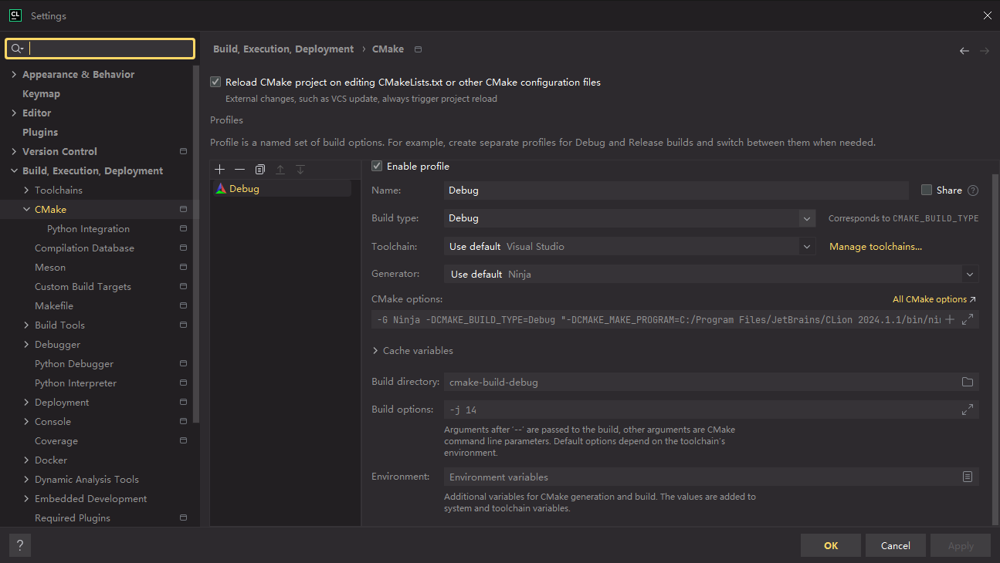

# Environment Configuration - Part 1

## Graphic Library
I decided to use the graphic library EasyX to render something on the screen. EasyX's installation is quite simple, just need to download the installer on https://docs.easyx.cn/en-us/setup and run it directly.

The CMakeLists.txt file looks like this
```cmake
cmake_minimum_required(VERSION 3.28)
project(slab)

set(CMAKE_CXX_STANDARD 17)
set(CMAKE_CXX_STANDARD_REQUIRED True)

set(EasyX_ROOT "C:/Program Files/Microsoft Visual Studio/2022/Community/VC/Auxiliary/VS")
set(EasyX_INCLUDE "${EasyX_ROOT}/include")
set(EasyX_LIB "${EasyX_ROOT}/lib/x64")

include_directories(${EasyX_INCLUDE})
link_directories(${EasyX_LIB})

add_executable(slab main.cpp)

target_link_libraries(slab EasyXa EasyXw)
```

I just simply set the EasyX path in the code, it's better passing it through the commandline.

## Mathematics Library
Another library we need is glm(OpenGL Mathematics), which is a header only C++ mathematics library for graphics software. You can pull the open source repository on its github site https://github.com/g-truc/glm.

After pulling the repository, we put the directory **glm** in our project, I create a 3rdParty folder for it, as well as some other third party libraries may be used in the future.

It's also necessary to modify the CMakeLists.text, here's the modified file
```cmake
cmake_minimum_required(VERSION 3.28)
project(slab)

set(CMAKE_CXX_STANDARD 17)
set(CMAKE_CXX_STANDARD_REQUIRED True)

Set(EasyX_ROOT "C:/Program Files/Microsoft Visual Studio/2022/Community/VC/Auxiliary/VS")
Set(EasyX_INCLUDE "${EasyX_ROOT}/include")
Set(EasyX_LIB "${EasyX_ROOT}/lib/x64")

include_directories(${EasyX_INCLUDE})
link_directories(${EasyX_LIB})

add_executable(slab main.cpp)

target_link_libraries(slab EasyXa EasyXw)
target_include_directories(slab PRIVATE ${CMAKE_SOURCE_DIR}/3rdParty/glm)
target_include_directories(slab PRIVATE ${CMAKE_SOURCE_DIR}/3rdParty/glm/gtc)
```

Different from EasyX, I just include the necessary glm include path with **target_include_directories**.

## Build
I developed this project with CLion 2023, the IDE provide build tools for cmake. All build options are default so far. if you also use CLion as your IDE, here's the CMake configuration


After above steps, I've completed basic environment configuration and the project can be built successfully. In the next part,
I'll try to draw a window on the screen and render something on it. 