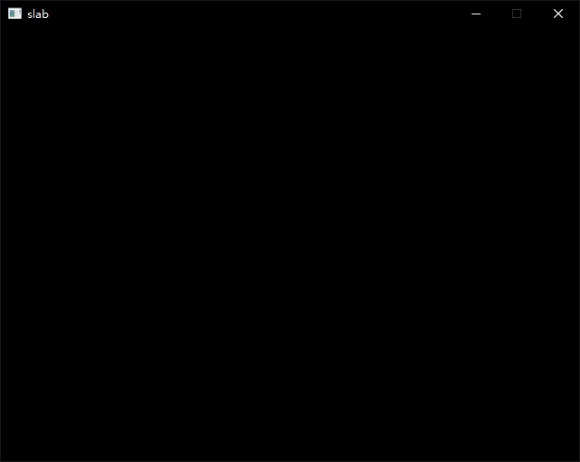

# Draw A Window
## Window
EasyX is a graphics library mainly for Windows(you need MinGW to build it).Thus I use <conio.h> to check if any key is pressed, which cannot be applied in Linux. 
Here's the code
```c++
int main(){
    // EasyX's init function
    initgraph(WIDTH, HEIGHT, EW_SHOWCONSOLE | EW_DBLCLKS);

    // receive keyboard event and exit
    while(!_kbhit()){
        Sleep(20);
    }

    // close EasyX
    closegraph();
    return 0;
}
```

Now build the project and run the .exe file, we can see a all black window on the screen


## Draw A Line
Now I'm going to draw a Line on this window.