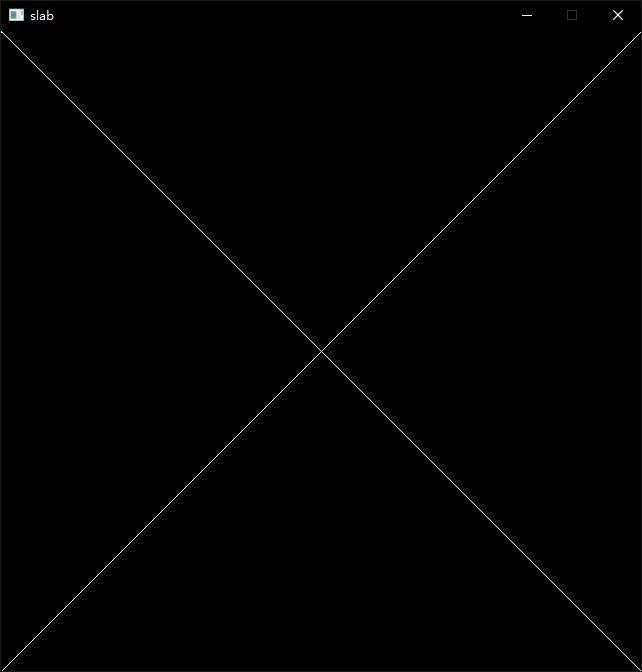

# Draw A Window
## Window
EasyX is a graphics library mainly for Windows(you need MinGW to build it).Thus I use <conio.h> to check if any key is pressed, which cannot be applied in Linux. 
Here's the code
```c++
int main(){
    // EasyX's init function
    initgraph(WIDTH, HEIGHT, EW_SHOWCONSOLE | EW_DBLCLKS);

    // receive keyboard event and exit
    while(!_kbhit()){
        Sleep(20);
    }

    // close EasyX
    closegraph();
    return 0;
}
```

Now build the project and run the .exe file, we can see a all black window on the screen


## Draw A Line
Now I'm going to draw a Line on this window. In fact, EasyX has its own **line** api, however, I'll implement a new one for study.

We know that the screen contains aligned, discrete pixels, and a line which is defined by a line equation is continuous. So to draw a line on the screen, we need to display a line with discrete pixels. That is to say, we need to judge which pixels are on the line.

A simple method is to calculate line's slope, and draw pixels step by step. For a line defined by two points $P_0(x_0, y_0)$ and $P_1(x_1, y_1)$, we can traversal from $x_0$ to $x_1$, and calculate y's value at each step, then find the closest pixel and this pixel should be on the line.

$$
k = \frac{y_1-y_0}{x_1-x_0}\\
\left\{
	\begin{array}{l1}
		x = x_0 + i\\
		y = round(y_0 + i * k)
	\end{array}
\right.
$$
Here's my implemention

```c++
void DrawLine(const glm::ivec2& p1, const glm::ivec2& p2, const HEX_COLOR& color){
    float k = (float)(p2.y - p1.y) / (float)(p2.x - p1.x);
    for(int x = p1.x; x <= p2.x; ++x){
        int y = (int)glm::round(k * (x - p1.x) + p1.y);
        setpixel(x, y, color);
    }
}
```

N.B. EasyX uses COLORREF to storage color, which is in fact 4-bytes-long DWORD. And its format is 0x00BBGGRR, the highest byte is invalid. To distinguish, I typedef COLORREF as HEX_COLOR and define a RGB_TO_HEX_COLOR(R, G, B) macro to convert RGB value to COLORREF.

```c++
typedef COLORREF HEX_COLOR;
#define RGB_TO_HEX_COLOR(R, G, B) COLORREF(((B) << 16) | ((G) << 8) | (R))
```

Now, we can call the function DrawLine and a line will occur on the screen



## Draw A Triangle

The next step is to draw a triangle, because almost all 3d models can be made up of millions of triangles. For the further development, I'd better figure out how to draw a triangle.

I've learned some theory on this tutorial https://jtsorlinis.github.io/rendering-tutorial/. However, I'll explain one of those methods.

